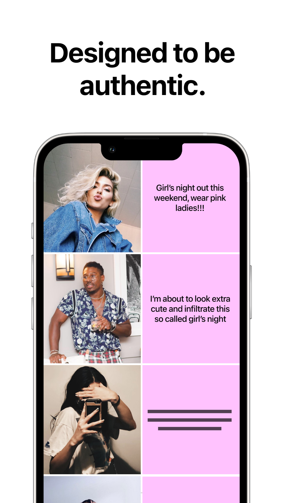
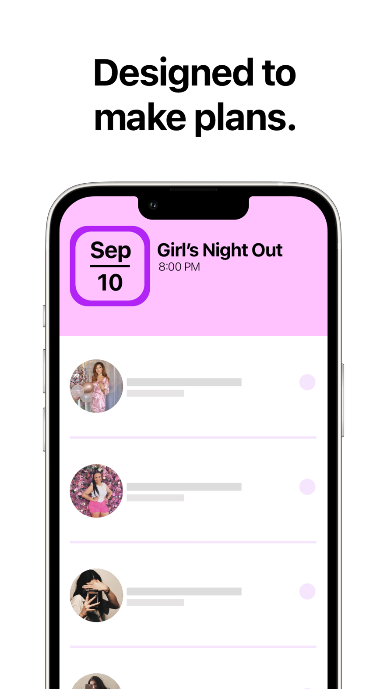
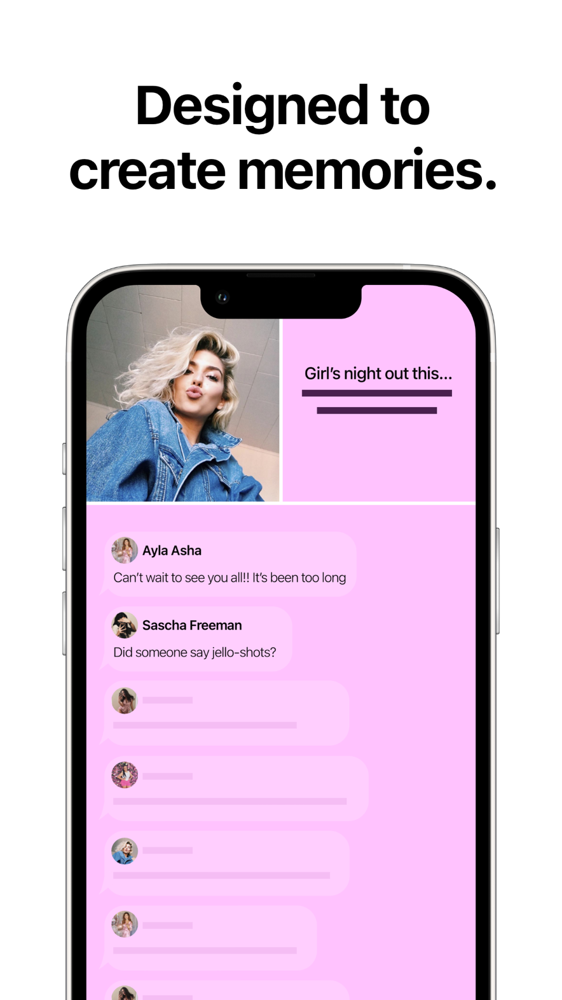
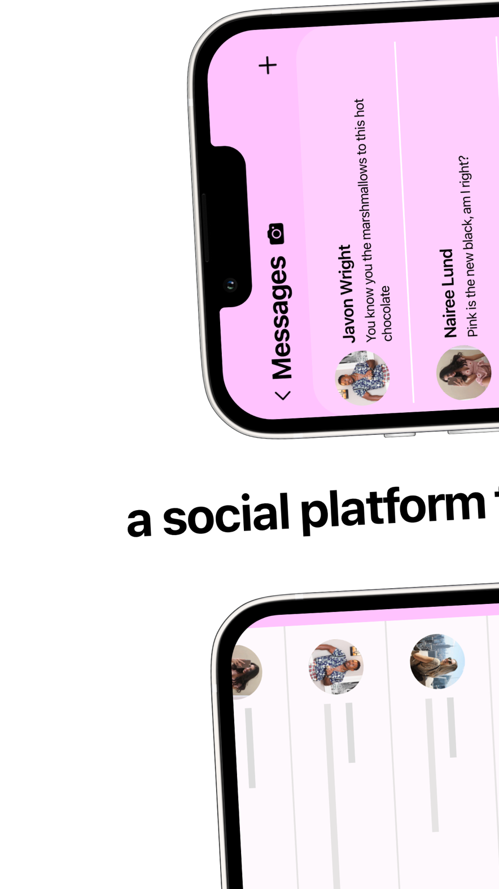
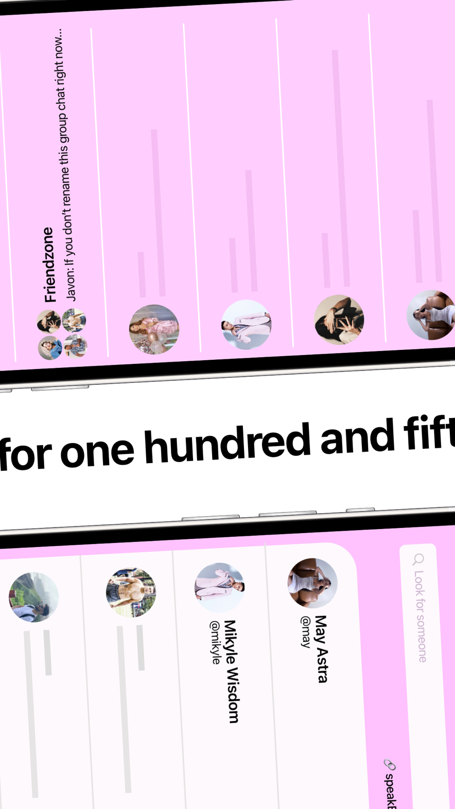
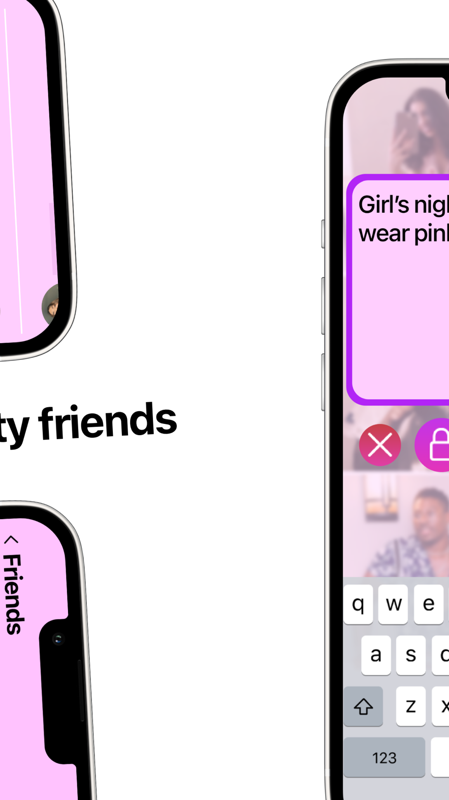
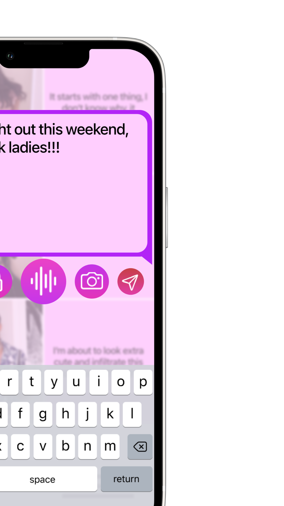
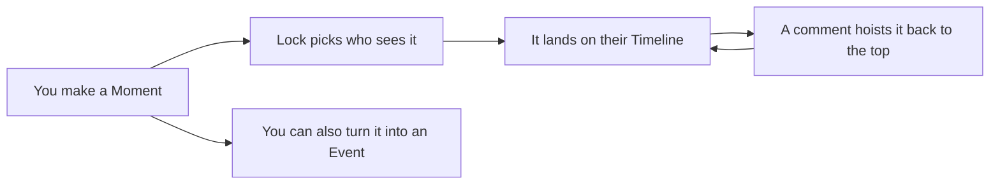
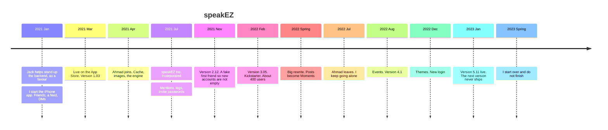

# speakEZ

A social app for 150 friends. Not a following.

I was the lead developer, the designer, and the company. I shipped this to the App Store in March 2021 and lived in it for three years. The last live version is 5.11, January 13, 2023. This repo is the iOS app and the Firebase cloud functions that made it run. I wrote most of it while I was still learning. It is not a starter kit.

Two things to get from this page: **the product**, and **the story**.

[Case study](https://yoshirozay.github.io/speakez-ios/) · [App Store](https://apps.apple.com/ca/app/speakez/id1558577008) · [Kickstarter](https://www.kickstarter.com/projects/carsonosullivan/speakez-redefining-social-media) · 4.8 from 44 ratings · still listed

<p align="center">
  
</p>

<p align="center">
  
  
  
</p>
<p align="center">
  
  
  
  
</p>

---

# The product

Group chat and a social feed in one place, hard-capped at 150 friends. Try 151 and you run into trouble. speakEZ will not make you famous, and it does not care if you are verified. It was for staying close to the people you already had.

The loop is simple:



## Features

- **Moments.** Text, photo, video, or audio. As many as you want. This is the post.
- **Locks.** Saved privacy lists. A moment only goes to the friends you pick, and you can reuse the lock next time.
- **Timeline.** Commenting hoists a moment to the top. Hot ones rise.
- **Comments.** Text, photos, videos, GIFs, or audio. Mentions open that person's profile.
- **Tags.** One tag per moment, so you can see who else is in it.
- **Messages.** 1-on-1 and group chat. Text, photos, videos, GIFs, audio. Offline send and retry.
- **Events.** Plan something in the real world, share a link, request to join.
- **Profiles.** Your moments, mutual friends, DMs from the profile. Search friends and strangers.
- **Themes.** The app was supposed to feel warm, not default-iOS.
- **The rest of a real social app.** Push notifications, read receipts, view-once, silence, phone auth, friend requests, delete account.

## What's in here

```
ios/         the iPhone app, as of the last ship
functions/   the Firebase cloud functions that made it run
```

## Stack

- iOS: Swift, SwiftUI, CocoaPods, Firebase, Realm, Core Data
- Backend: Firebase Auth, Firestore, Storage, Cloud Functions

The phone is the client. Functions handle the things a client should not own: likes, comments, mentions, tags, notifications, group chat, events, view-once, delete account.

## Under the hood

Firebase was the source of truth. The phone tried not to feel like it.

- **Image and video cache.** Profile photos, moment media, and chat images stayed on device so the timeline did not refetch everything.
- **Realm.** Failed DMs queued locally and retried without waiting for the next launch.
- **Offline-ish UI.** Friends, posts, and conversations were cached so opening the app on a bad train still showed something.
- **Pagination.** Timelines and long threads did not load the whole graph at once. We learned that the hard way.

This is also the part that is dated. Nobody should copy the caching as a reference.

## Database

Firestore. No SQL. No joins. The graph is exploded into collections so the phone can read one person's slice.

Most top-level collections are keyed by `userId`, then a subcollection for that person's stuff. A moment is not one row. It is a document under `Posts` / `UserPosts`, with `Comments`, `Likes`, `ReadPost`, and `CommentSubscription` hanging off it. A chat is `UserChats` plus `Messages` / `ChatMessages`. An event is written in several places at once: `Events`, `MyEvents`, `HostedEvents`, plus `InvitedUsers`, `AttendingUsers`, `Hosts`, `RequestToJoin`, and `EventConversation`.

The other big piles:

- **People.** `Users`, `UserInfo`, `UserDetail`, `Settings`, `Friends`, `FriendRequests`
- **Social.** `Posts`, `Comments`, `Likes`, `Tags`, `SavedPosts`, `Silence`
- **Chat.** `UserChats`, `Messages`, `ChatMessages`
- **Events.** the fan-out above
- **Noise.** `Notifications`, `Badge`, `Reports`

That is the usual NoSQL trade. Writes are messy. Reads for a single user are cheap. There is no elegant schema to admire. The structure *is* the product: users, moments, threads, rooms.

---

# The story

I built speakEZ because I was watching real friendships fade. High school and university people (an Olympian, a firefighter, future lawyers) turning into memories. Instagram and Snapchat were full of the world and empty of the people I actually knew. I wanted a cozy room for 150 friends, with a door that opened into real life.

I was the lead. I funded it, I shipped it, I lived in the code for three years. I hired help for the parts I could not carry alone. I still wrote most of it.

## What I did

- Designed the product: 150-friend cap, Moments, Locks, Events, the "this will not make you famous" rule.
- Wrote the first version alone and shipped **1.03** to the App Store on March 20, 2021, about eight weeks after I started.
- Incorporated **speakEZ Inc.** on July 29, 2021.
- Ran a [Kickstarter](https://www.kickstarter.com/projects/carsonosullivan/speakez-redefining-social-media). At the time I said we had about 400 users. I was trying to raise $10k: freelancers, servers, in-app purchases, fees.
- Hired **Ahmad** to make the app actually run (cache, camera, video, pagination, offline DMs, group chat on the client).
- Hired **Sultan** for push notifications.
- **Jack** stood up the first cloud functions as a favour, January 2021, before I had even started the iPhone app. Three days. I owe him that start.
- After Ahmad left in July 2022 I finished it alone: events, version 4.1, a full theme system, a new login, notification routing, a timeline for people who had not posted yet. Almost a year of that.
- Shipped the last live version, **5.11**, on January 13, 2023. I had already started the next one. It never went out.

I was learning to program for most of this. The code is ugly in places because I was ugly at it. I still finished a real social app.

## Timeline



Versions that actually went out: **1.03** → **2.12** → **3.05** → **4.1** → **5.11**. I had already started 6.x. That one stayed on my machine.

## People

I designed and shipped the product: the first App Store build, mentions, tags, locks, silence, events, themes, the last year of UI, and most of the cloud functions.

**Ahmad Naeem ([@ahmadnaeem908](https://github.com/ahmadnaeem908))** was hired to build the engine, April 2021 to July 2022. Cache, camera, video, pagination, offline DMs, group chat on the client, read receipts, phone auth, the intro flow. If the app felt fast instead of broken, that was mostly him.

**Sultan Butt ([@sultan820](https://github.com/sultan820))** was hired for push notifications: new posts, group messages, badge counts.

**Jack Cohen ([@jackcohen5](https://github.com/jackcohen5))** did me a favour in January 2021. He stood up the functions repo and wrote the first friend-request function. That is the whole of it, and it mattered.

## Status

Not maintained. Last store release January 13, 2023. speakEZ Inc. was later dissolved. The listing is still up. I am not taking feature PRs. If you find a secret I missed, open an issue.

## License

MIT
